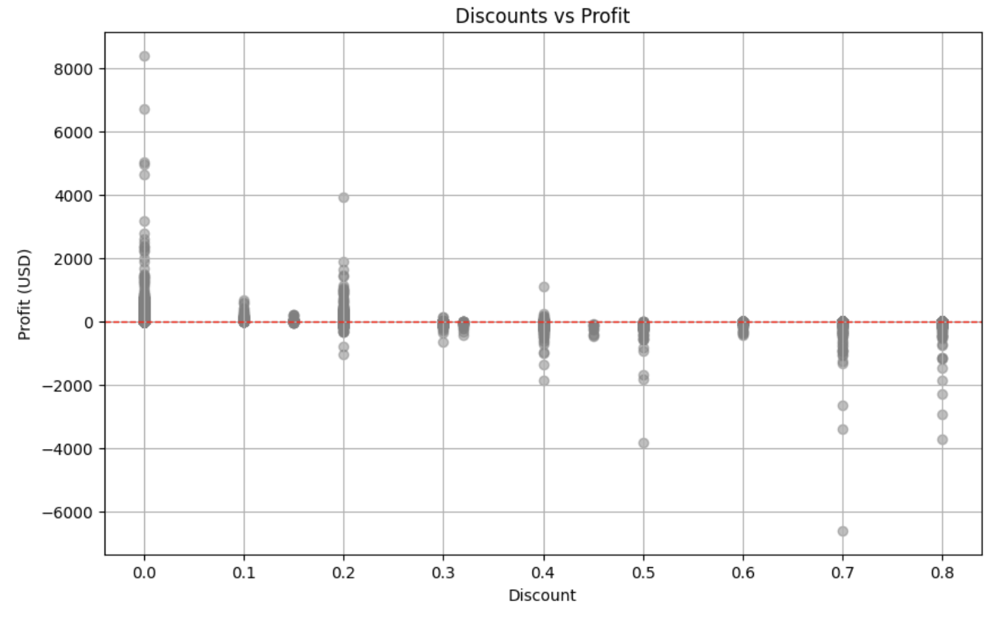

# A. Sales Performance Analysis

## Objective:
Analyze sales trends over time to identify key seasonal patterns, high-performing product categories, and regional sales disparities. The goal is to optimize inventory, promotions, and marketing strategies for peak sales periods and regions.

In **early 2014**, sales begin low, reflecting the typical post-holiday decline seen in **January and February**. As consumer spending picks up, sales rise steadily until **May**, likely driven by spring promotions. The summer months of **June to August** show a predictable drop, consistent with a shift in consumer focus toward vacations and travel.

Sales rebound in **November and December of 2014**, aligning with holiday shopping trends. This pattern repeats in **2015** and **2016**, with clear peaks during the holiday season and declines in early **January** and mid-year. Notably, **late 2017** shows the highest sales spike yet, marking a successful holiday period.

## Key Drivers:
- **Post-holiday slowdown** in **January-February** due to consumer fatigue and reduced spending.
- **Summer dips** during **June-August**, when discretionary spending shifts to vacations.
- **Holiday surges** in **November-December** fueled by end-of-year shopping.

---

## Visualizations

### 1. Sales Trend Over Time

The sales trend reveals clear cyclical patterns with peaks during holiday months and declines during post-holiday and summer periods.

---

### 2. Sales by Product Category

Technology leads in total sales, closely followed by Furniture, while Office Supplies underperform slightly. This indicates where inventory and promotional focus should be.

---

### 3. Sales by Region

The East and West regions lead in total sales, while the South underperforms, indicating potential for regional growth strategies.

---

## Actionable Business Recommendations

### 1. Capitalize on Holiday Peaks

- **Insight**: Sales consistently peak during **November and December**, driven by holiday shopping.
- **Recommendation**:
  - **Increase inventory** for high-demand products (especially **Technology** and **Furniture**) to ensure stock availability during the holiday season.
  - **Aggressive marketing**: Invest heavily in targeted digital and physical marketing campaigns leading up to and during the holiday months to capture maximum consumer interest.
  - **Exclusive holiday promotions**: Offer special holiday bundles or limited-time discounts to encourage higher transaction values.

### 2. Mitigate Post-Holiday Declines

- **Insight**: Sales significantly dip in **January and February** due to post-holiday consumer fatigue.
- **Recommendation**:
  - **New Year promotions**: Run New Year Resolution-themed promotions focusing on home office upgrades (for **Office Supplies**) and technology products that help people start the year strong (such as laptops and other work-related technology).
  - **Clearance sales**: Offer discounts on leftover holiday inventory to maintain sales momentum.
  - **Loyalty incentives**: Provide discounts or rewards to loyal customers who make purchases in **January and February** to encourage repeat business.

### 3. Boost Summer Sales

- **Insight**: Sales typically drop in **June through August**, likely due to shifting consumer priorities toward vacations and travel.
- **Recommendation**:
  - **Back-to-school campaigns**: Begin back-to-school promotions in **July** for **Office Supplies** and **Technology** categories, capturing early demand.
  - **Summer promotions**: Introduce summer-specific campaigns targeting **Technology** products that are portable and useful for vacations, such as laptops, tablets, and accessories.
  - **Seasonal product bundles**: Bundle slower-moving items with high-demand summer products (like travel-related tech) to boost sales and clear inventory.

### 4. Focus on Regional Growth

- **Insight**: The **East** and **West** regions consistently outperform the **South** in sales.
- **Recommendation**:
  - **Expand successful strategies**: Analyze what drives the higher performance in the **East** and **West** regions (e.g., marketing strategies, local consumer preferences) and replicate these tactics in the **South**.
  - **Localize marketing efforts**: Tailor marketing campaigns to resonate with regional preferences in the **South**—this could include special promotions or product offerings that align with local cultural events or consumer behavior.
  - **Regional pricing and product availability**: Assess whether product availability or pricing strategies in the **South** can be adjusted to drive more sales in this underperforming region.---

# B. Profitability Analysis Report

## Objective:
Identify which customer segments (Consumer, Corporate, Home Office) drive the most sales and profit, and analyze average order sizes to determine which customer group offers the highest value. This will help in tailoring marketing and sales strategies to each segment.

## 1. Profit by Region

The **Profit by Region** chart shows clear differences in profitability across regions. The **East** and **West** regions outperform the **Central** and **South**, suggesting a need for targeted strategies to drive growth in underperforming areas.

### Key Insights:
1. **Top-Performing Regions**: The **East** and **West** regions generate the highest profits, showcasing strong market penetration.
2. **Underperformance in Central and South**: The **Central** and **South** regions show lower profit margins, indicating potential inefficiencies or lower demand.
3. **Growth Opportunity**: Strategic initiatives in the **South** region can improve profitability.

---

## 2. Profit by Product Category

The **Profit by Product Category** chart highlights that **Technology** is the most profitable category, while **Furniture** holds steady and **Office Supplies** lags behind.

### Key Insights:
1. **Technology Leads**: **Technology** is the most profitable category, outpacing others significantly.
2. **Furniture Stability**: While **Furniture** contributes well to profits, there’s room for optimization.
3. **Office Supplies Underperformance**: **Office Supplies** generate the lowest profits, suggesting a need for category reassessment.

---

## 3. Profit by Customer Segment

The **Profit by Customer Segment** chart shows that the **Consumer** segment drives the most profit, followed by **Corporate**, with **Home Office** underperforming.

### Key Insights:
1. **Consumer Dominates**: The **Consumer** segment generates the highest profit.
2. **Corporate Segment Potential**: The **Corporate** segment presents growth opportunities through targeted offerings.
3. **Home Office Underperformance**: This segment requires a more personalized strategy to boost profitability.

---

## Business Plan - Key Recommendations

### 1. Expand in Underperforming Regions
   - **Recommendation**: Focus on expanding operations and marketing efforts in the **South** and **Central** regions, using successful strategies from the **East** and **West** regions.

### 2. Boost Office Supplies and Furniture Categories
   - **Recommendation**: Enhance profitability in **Office Supplies** and **Furniture** through product bundling, cross-selling, and strategic pricing adjustments.

### 3. Target Corporate and Home Office Segments
   - **Recommendation**: Develop specialized solutions and services for the **Corporate** and **Home Office** segments, such as bulk discounts and enterprise-level services to drive profit growth.

---

This business plan leverages the key profitability insights from the **Regional**, **Product Category**, and **Customer Segment** analyses to drive strategic growth and optimize performance.

# C. Customer Segment Analysis Report

## 1. Sales and Profit by Customer Segment

This chart shows the breakdown of **Total Sales** and **Total Profit** for each customer segment: **Consumer**, **Corporate**, and **Home Office**. The data reveals distinct patterns in how each segment contributes to revenue and profitability.

### Key Insights:
1. **Consumer Dominates in Sales**: The **Consumer** segment drives the highest total sales, making it the most crucial for overall revenue generation.
2. **Corporate Offers Balanced Profit**: The **Corporate** segment shows a good balance between sales and profit, contributing significantly to both, but with room for expansion.
3. **Home Office Lags Behind**: The **Home Office** segment generates the least profit, indicating a need for strategic adjustments in marketing or product offerings.

---

## 2. Average Order Size by Customer Value in Corporate and Home Office Segments

This chart divides the **Corporate** and **Home Office** segments by **High Value** and **Low Value** customers, based on average order size. It highlights differences in customer behavior within these segments.

### Key Insights:
1. **High-Value Customers Spend More**: Both the **Corporate** and **Home Office** segments show significantly higher average order sizes for **High Value** customers.
2. **Low-Value Customers Dominate Volume**: While **Low Value** customers have smaller average order sizes, they likely contribute more in terms of volume, suggesting opportunities for upselling.
3. **Corporate Segment Shows Potential**: The **Corporate** segment, especially among **High Value** customers, presents an opportunity to tailor high-end products or services.

---

## Business Recommendations

### 1. **Focus on Expanding Corporate High-Value Customers**
   - **Recommendation**: The Corporate segment shows promise, especially among high-value customers. Develop specialized services or exclusive offers for this group to increase average order size and profitability.

### 2. **Revitalize Home Office Segment with Tailored Campaigns**
   - **Recommendation**: The Home Office segment lags in profitability. Create targeted marketing campaigns to upsell and cross-sell to **Low Value** customers, converting them into high-value customers through personalized offers and product bundles.

### 3. **Maximize Consumer Retention and Growth**
   - **Recommendation**: Given the dominance of the **Consumer** segment, invest in customer retention strategies, such as loyalty programs and personalized offers, to maintain and grow this segment’s contribution to both sales and profit.

---

These insights and recommendations provide actionable steps to enhance business performance by focusing on key customer segments and capitalizing on high-value opportunities.

# D. Discount Impact on Profit Analysis Report

## 1. Average Profit by Discount Level

This chart shows the **average profit** across different discount levels (**Low**, **Medium**, and **High**). It highlights how varying discount rates affect profitability.

### Key Insights:
1. **Low Discounts Maximize Profit**: Low discounts (0-10%) result in the highest average profit, showing that smaller discounts effectively drive sales without heavily eroding margins.
2. **Medium Discounts Reduce Profit**: Medium discounts (10-20%) significantly reduce average profit, but still maintain a positive profit margin.
3. **High Discounts Are Unprofitable**: High discounts (20-50%) lead to negative profits, meaning deep discounts should be used sparingly.

---

## 2. Discounts vs Profit

This scatter plot illustrates the relationship between individual **discount rates** and **profit** across transactions. It helps identify how discounts affect profitability on a per-transaction basis.

### Key Insights:
1. **Negative Profit at High Discounts**: Transactions with higher discount rates frequently result in negative profits, suggesting that deep discounts often lead to losses.
2. **Profits Cluster Around Low Discounts**: Profitable transactions tend to cluster around lower discount rates, supporting the idea that small discounts are more sustainable.
3. **High Discount Variability**: Higher discounts introduce variability, with many resulting in losses, reinforcing the need to limit deep discounts.

---

## 3. Profit Distribution by Discount Level

This box plot shows the **distribution of profit** across **Low**, **Medium**, and **High** discount levels, highlighting the range and outliers for each category.

### Key Insights:
1. **Low Discounts Yield Consistent Profits**: Low discounts offer a more consistent range of positive profits, with fewer outliers and variability.
2. **High Discounts Have Wide Profit Variability**: High discount levels show a wide range of profit variability, with most values falling below zero.
3. **Medium Discounts Lead to Unstable Profits**: The medium discount range still sees some negative profit outliers, but generally maintains a balance between higher volume and profitability.

---

## 4. Profit Trend Over Time by Discount Level

This chart tracks the **profit trend** over time (by year) for each discount level, showing how discounts have affected profitability over several years.

### Key Insights:
1. **High Discounts Consistently Unprofitable**: The negative profit trend for high discounts remains consistent over time, showing little improvement in their effectiveness.
2. **Low Discounts Maintain Profitability**: Low discounts show steady positive profits year over year, proving to be the most reliable strategy for maintaining healthy margins.
3. **Medium Discounts Show Fluctuations**: Medium discounts have fluctuated, but generally show a downward trend, indicating a need for caution when offering medium-level discounts.

---

## **Business Recommendations**

### 1. **Limit High Discounts**:
   - **Insight**: High discounts consistently result in negative profits and should be avoided for most products. Reserve deep discounts for special cases, such as clearance sales, where volume and inventory management take priority.

### 2. **Focus on Low Discounts**:
   - **Insight**: Low discounts (0-10%) provide the best balance between sales volume and profitability. Implementing smaller discounts across most products will drive sales while maintaining healthy profit margins.

### 3. **Monitor Medium Discounts Strategically**:
   - **Insight**: Medium discounts (10-20%) show mixed results. Regularly monitor their impact on profit margins and consider adjusting based on product performance and market conditions. Tailor these discounts for specific segments or promotional periods where the tradeoff between profit and volume is justified.

---

These insights and recommendations provide a data-driven approach to optimize discount strategies, balancing profitability and sales growth.
